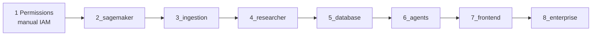
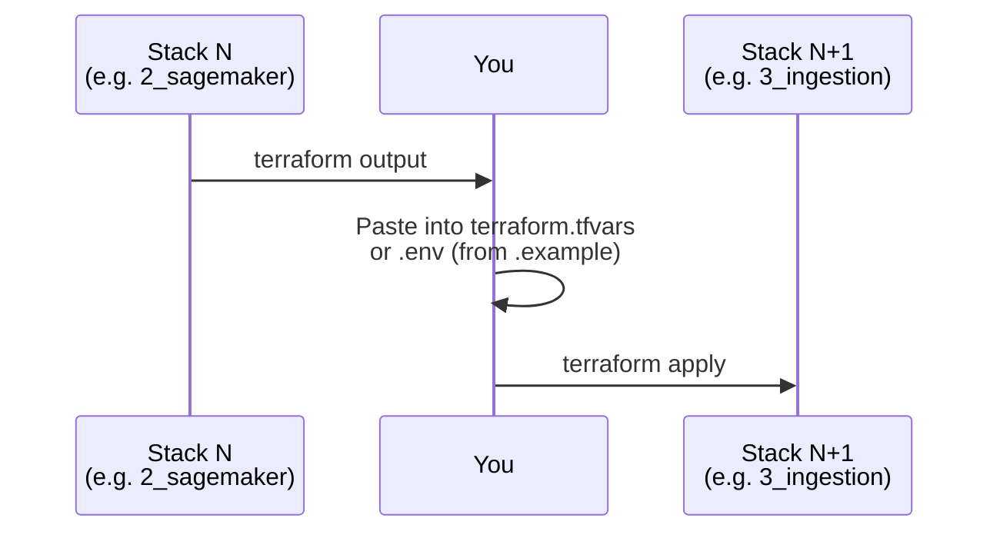
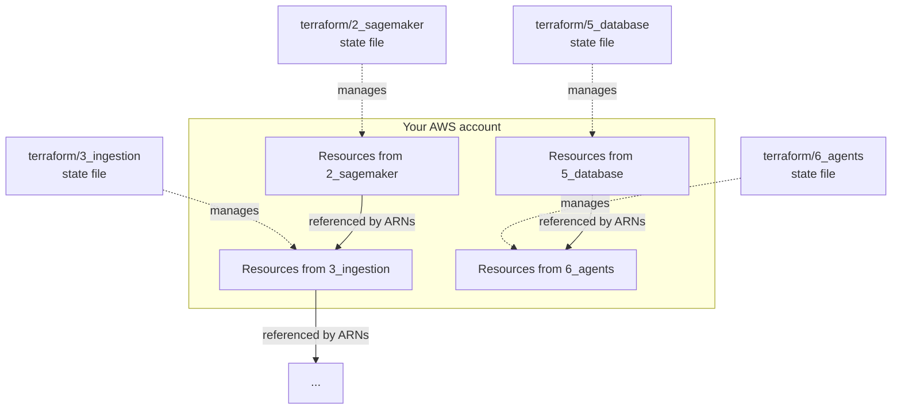

# How the Terraform Directories Interact (Alex, AWS)

This page explains how **infrastructure in `terraform/…` is wired together** in this course. It is not a second tutorial; read it when you are confused about “why is there so many folders?” or “where do ARNs come from?”

---

## The core idea: stacks are independent

Each numbered Terraform directory (for example `terraform/2_sagemaker`, `terraform/3_ingestion`, …) is a **separate root module**:

| Property | What it means for you |
|--------|------------------------|
| **Own directory** | You `cd` into that folder, run `terraform init` / `plan` / `apply` there. |
| **Local state** | A `terraform.tfstate` file lives in that directory (gitignored). State is not shared in S3. |
| **No automatic dependency** | Terraform in `5_database` does **not** read state from `3_ingestion` as a `terraform_remote_state` data source. |

So the stacks do **not** “call each other” the way one microservice calls another. They are **isolated** on purpose: you can deploy in order, destroy one part, or pause between guides without needing a state backend for the whole system.

**How they still connect in production:** the **cloud resources** (ARNs, URLs, IDs) exist in **your** AWS account. The **link** from stack A to stack B is you **copying outputs** into the next guide’s `terraform.tfvars` and (often) your root `.env`.

That handoff is the “communication” between directories.

---

## Suggested order (same as the guides)

- **1_permissions** is console + IAM, not a Terraform map.
- **2 → 8** are the Terraform roots under `terraform/` (skip numbers that are not in your tree if the course was trimmed).

You **must** apply the earlier piece before the later one when the later one needs a resource the former creates (for example database cluster ARN for agents).

---

## How values flow: outputs → you → `terraform.tfvars` / `.env`

Typical handoffs (names vary—always read each guide and `terraform.tfvars.example`):

- **SageMaker endpoint / name** needed by the ingest Lambda and Python scripts.
- **Ingest / vector / API** URLs and keys for the researcher and local tests.
- **App Runner** URL and IAM pieces where the researcher must call APIs.
- **Aurora cluster ARN, secret ARN,** resource IDs for the shared `backend/database` library and later Lambdas.
- **SQS queue, Lambda names, S3 package bucket,** and API Gateway IDs for the frontend and orchestration.
- **CloudFront, S3, API** URLs for the Next.js app and Clerk / CORS settings.

**Rule of thumb:** after every successful `apply`, run `terraform output` in that directory and add anything the **next** guide’s example file asks for.

---

## What is *not* used here

- **No shared remote state** between student stacks in the default course layout (keeps the course simple).
- **No automatic import** of one stack’s outputs into another; that would require `terraform_remote_state` or a pipeline—out of scope for the learning path.
- **Git** does not carry your secrets: `.env` and `terraform.tfvars` stay local / CI secrets.

---

## Mental model: one AWS account, many state files

**Important:** if you `destroy` an older stack, anything in a **later** stack that still points at deleted ARNs will break until you re-apply the earlier stack and update the later one’s variables.

---

## If you are on GCP (optional)

The repository may include a **`terraform/gcp/`** layout (single project, Cloud Run, **Cloud SQL** PostgreSQL, GCS uploads, Secret Manager, WIF for GitHub Actions). That is a **different** track from the numbered `terraform/2_…/8_…` AWS modules. It still uses the same *idea* of “one Terraform root, local state, wire outputs and secrets by hand,” but the app talks to **Postgres on Cloud SQL** (and env vars from `cloud_run.tf`), not to Aurora or S3. See `terraform/gcp/README.md` for the exact variables and the first-time DB migration options.

---

## See also

- [1_permissions.md](1_permissions.md) – IAM and first files.
- [architecture.md](architecture.md) – product architecture (services and data flow).
- Each guide from [2_sagemaker.md](2_sagemaker.md) onward for **exact** required variables and outputs for that week.

If something fails with “resource not found” or “AccessDenied,” check: **region consistency**, **terraform.tfvars** in *this* directory, and **values copied from the previous** `terraform output`—in that order.
