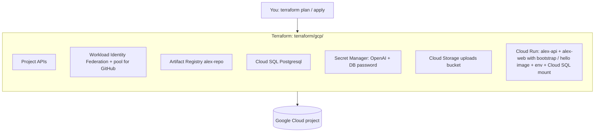
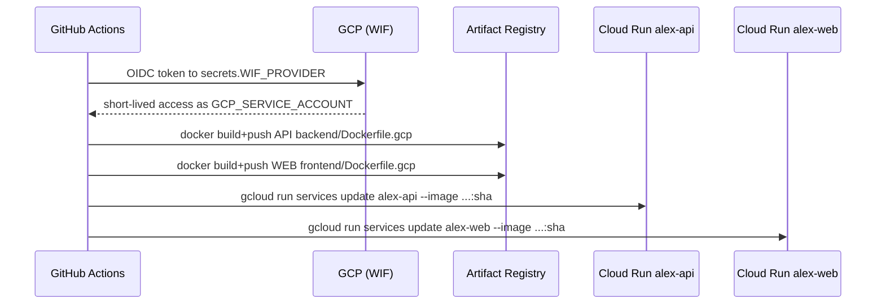
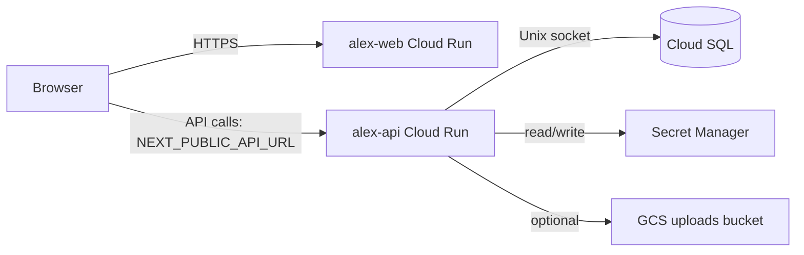

# App flow: Terraform, runtime, and GitHub Actions (GCP)

This is the **end-to-end picture** for the Tolu-style GCP path: what you apply once with Terraform, how the app runs, and what happens on every push to `main`.

---

## Right after the proxy starts (local migrations)

1. **Leave** Terminal 1: `./cloud-sql-proxy … --port 5432` (running).
2. **New** Terminal 2:
   ```bash
   cd backend/database
   uv run run_migrations.py
   ```
3. If triggers fail (e.g. `EXECUTE FUNCTION`), the SQL in `run_migrations.py` may need PostgreSQL-syntax tweaks for your engine version; fix or run statements via `gcloud sql connect` as needed.

---

## One-time: Terraform creates the platform

You run this **on your machine** (or a CI that has Terraform + Google credentials), not in the same job as the Docker build.



- **WIF** ties a **specific GitHub repository** (from `github_repo` in `terraform.tfvars`, e.g. `owner/name`) to a **deployer service account** that can push images and update Cloud Run.
- **Cloud Run** is created with a **placeholder image**; `lifecycle.ignore_changes` on `image` so **Terraform does not fight** the pipeline that later sets real image tags.
- **Secrets and DB password** are stored; the API service reads **env + Secret Manager** refs (see `cloud_run.tf`).

**Terraform does *not* run the Next.js or FastAPI build in this project.** It only creates infrastructure and the empty/revision wiring.

---

## Every push to `main`: GitHub Actions deploys the app

Workflow: **`.github/workflows/deploy-gcp.yml`** (`Deploy GCP (Cloud Run)`).  
Triggers: `push` to `main` and `workflow_dispatch`.



| Step in the workflow | What it does |
|----------------------|----------------|
| Checkout | Clones the repo. |
| Check secrets | Fails if `WIF_PROVIDER` or `GCP_SERVICE_ACCOUNT` is missing. |
| Check `vars` | Fails if `GCP_PROJECT_ID` is missing (needed for image URL). |
| `google-github-actions/auth` | Exchanges OIDC for a GCP access token. |
| `gcloud` + `configure-docker` | Pushes to `europe-west1-docker.pkg.dev/.../alex-repo/`. |
| Build API | `docker build -f backend/Dockerfile.gcp` → tag with `github.sha`. |
| Build WEB | `frontend/Dockerfile.gcp` with `NEXT_PUBLIC_CLERK_*` and `NEXT_PUBLIC_API_URL` (must be set in repo settings). |
| Deploy | `gcloud run services update` for **both** services with the new digests. |

**Images path:** `REGION-docker.pkg.dev/GCP_PROJECT_ID/alex-repo/{alex-api,alex-web}:$GITHUB_SHA`.

**Terraform vs Actions (who owns what):**

| Concern | Terraform (once) | GitHub Actions (each deploy) |
|--------|-------------------|------------------------------|
| Resource existence | yes | no |
| Cloud Run *revision* with new **container image** | no (ignored) | **yes** (`gcloud run services update`) |
| Image push to AR | no | **yes** |
| Env vars / secrets *definition* for the service | yes (first apply) | no (unless you add a step) |

---

## Request flow in production (browser)



- **Clerk** validates JWTs; backend uses `CLERK_JWKS_URL` / `CLERK_ISSUER` (from Terraform + earlier deploy).
- **CORS** may need the Cloud Run `alex-web` URL in `CORS_ORIGINS` on the API if you get browser blocks (configure in `backend/api` or future Terraform).

---

## Other GitHub Action in this repo

- **`Guides & Terraform index`** (`.github/workflows/guides.yml`) — on changes under `guides/`, writes an **index** in the run **Summary** (not a deploy). Unrelated to GCP but useful for the course docs.

For GitHub **repository settings** (variables vs secrets) for the deploy workflow, see the main [README](README.md) in this directory.
